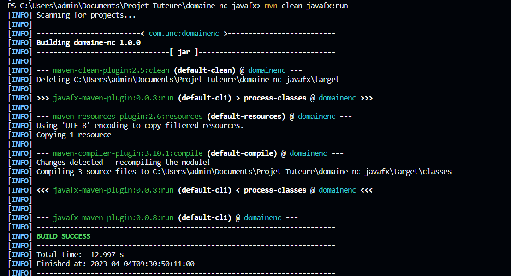
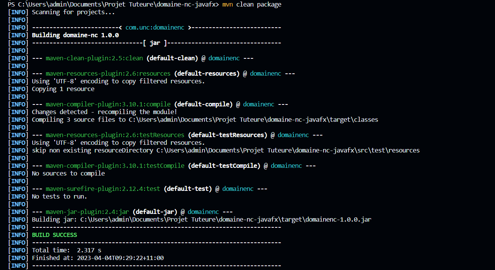

# ❔ A propos

Application JavaFX pour consulter les données de DOMAINE.nc, développée en projet tutoré entre :

- [🧑‍🎓 UNC Nouvelle-Calédonie](https://unc.nc/)
- [🏢 OPT-NC/GLIA](https://bit.ly/3RuNs1o)

# 🎯 Objectif

> Appli **[JavaFX](https://openjfx.io/) disruptive Desktop** pour consuleter les noms de [DOMAINE.nc](https://www.domaine.nc/) via son [API publique](https://rapidapi.com/opt-nc-opt-nc-default/api/domaine-nc/details).

# 📄 Prérequis

1. Disposer de `JDK 17+`.
2. Créez un fichier .env à la racine du projet avec votre clé d'API.

```shell
X-RAPIDAPI-KEY=Votre_clef_d'API
```

# 🕹️ Utiliser

Exécutez:

```shell
mvn javafx:run
```



# 💿 Installation

Build le projet sous maven :

```shell
mvn clean package
```



# 🧑‍🤝‍🧑 Team

- [👦 Kevin](https://dev.to/kpetit)
- [👦 David](https://dev.to/davnox900)
- [👦 Irwan](https://dev.to/isoernc)
- [👨 adriens](https://dev.to/adriens)

# 🔖 Ressources utiles

- :octocat: [lschaeffer313/domaine-nc-mobile`](https://github.com/lschaeffer313/domaine-nc-mobile)
- 📝 [📢 Unboxing Domaine NC mobile `v1.3.0`](https://dev.to/optnc/unboxing-domaine-nc-mobile-v130-59pi)
- 📝 [📢 DOMAINE.NC mobile `v1.0.7` sur le PlayStore 🛍️ ](https://dev.to/adriens/domainenc-mobile-v107-sur-le-playstore-5741)